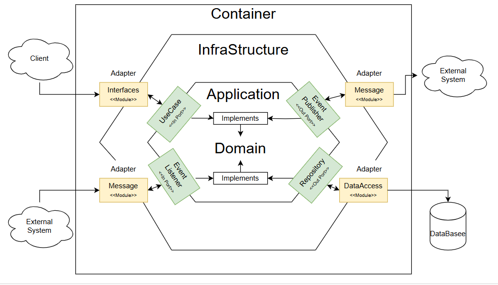

# DDD-hexagonal-Example

## 목표
* Hexagonal Architecture(육각형)의 장단점 확인
* Adapter Pattern 과 CQRS Pattern 적용 전 연습

##  모듈 구조
### Common
- 각각의 모듈에서 공통으로 사용되는 공통 모듈
- 해당 프로젝트에서는 추상화된 DDD 개념만 적용함

### Container
- MainClass 및 애플리케이션 전체 구성을 관리

### Domain (도메인 계층)
- 핵심 비즈니스 로직과 규칙 구현
- 외부 시스템이나 기술에 의존하지 않고, 순수한 비즈니스 규칙

| 구분    | 패키지  명    | 비고           |
|-------|-----------|--------------|
| class | entity    | 엔티티          |
|       | event     | 도메인 이벤트      |
|       | vo        | Value Object |
|       | exception | 도메인 관련 예외 선언 |

### Application (응용 계층)
- 도메인 계층을 호출하여 비즈니스 로직 처리

| 구분        | 패키지  명                   | 비고                     |
|-----------|--------------------------|------------------------|
| class     |                          | 응용 구현                  |
| interface | ports - in - event       | 외부 시스템 Input Port 선언   | 
|           | ports - in - UseCase     | 애플리케이션 Input Port 선언   |
|           | ports - out - event      | 도메인에 대한 이벤트 발행 Port 선언 | 
|           | ports - out - repository | Repository 선언          | 

### Interfaces (Infrastructure)
- Application Interface 구현 (API)
- UseCase를 외부에서 사용할 수 있도록 인터페이스 제공
- ex) RestAPI

### DataAccess (Infrastructure)
- 영속성&데이터 관련 Port Adapter

### Message (Infrastructure)
- Event 관련 Port Adapter
